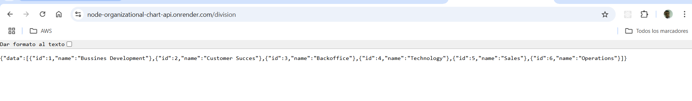

# Welcome Node express web server and backend!



## Getting Started

### Installation

Install the dependencies:

```bash
npm install
```

### Development

Start the development server:

```bash
npm run dev
```

Your application will be available at `http://localhost:3000`


#### Env File

You are going to need a `.env` file like this one:

```bash
API_ALLOW_ORIGINS=your-app-url-origin
PORT=your-api-port
```

### Deployment CI/CD

- Render.com - Github integration

### Demo:

- Stage: https://node-organizational-chart-api.onrender.com